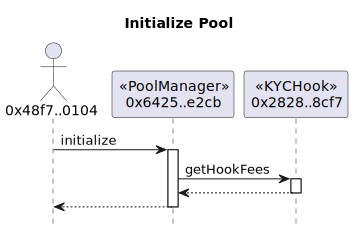

Under developing...


## Overview
This repo creates a simple demo on a compliant DEX pool, using off-chain data attestations and the Hook feature in Uniswap v4. We emphasise this repo is a prototype only, please don't use it in any product environment. 

Off-chain data attestations are privacy-preserving data proofs created by end users, through the [PADO](https://padolabs.org) protocol. PADO is a cryptographic attestation protocol to bring all Internet data into smart contracts.

The demo implements the following [proposal](https://hackmd.io/QXi9YUvUSwmqxCuGl7Z9XA), where users with submitted proofs-of-KYC-status can be privileged to swap tokens on DEX. This enables new scenarios like institutional swaps.

)


Besides the demo, PADO is an attestation protocol to support:
1. connecting with arbitrary data sources from TLS transmission, and proving the data authenticity;
2. general-purpose data computation with zkSNARKs;
3. high performance on any end-to-end process; 

## Install

Get the repo:

```sh
git clone --recursive https://github.com/pado-labs/pado-uniswap.git
```

- [Hardhat](https://hardhat.org/)

```sh
cd pado-uniswap
npm install
npm run compile
```


- [Foundry](https://book.getfoundry.sh/)

```sh
cd pado-uniswap
forge install
forge update v4-periphery
forge build
```

## KYC Hook

The [KYCHook](./src/hooks/KYCHook.sol) implements the `beforeModifyPosition` and `beforeSwap` hooks.


## Local

- [Local testing (Hardhat)](./docs/README.hardhat.md)
- [Local testing (Foundry)](./docs/README.foundry.md)


## Sepolia


### Preparations

1. Reference [.env.example](./.env.example) sets your private key in [.env](./.env).
2. Set the following addresses in [.address](./.address):
   - A deployed [Uniswap v4 Pool Manager](https://sepolia.etherscan.io/address/0x64255ed21366DB43d89736EE48928b890A84E2Cb). 
   - The arguments of KYCHook ([EAS](https://sepolia.etherscan.io/address/0xC2679fBD37d54388Ce493F1DB75320D236e1815e), [EASProxy](https://sepolia.etherscan.io/address/0x140Bd8EaAa07d49FD98C73aad908e69a75867336), [SchemaKyc](https://sepolia.easscan.org/schema/view/0x5f868b117fd34565f3626396ba91ef0c9a607a0e406972655c5137c6d4291af9), [SchemaCountry](https://sepolia.easscan.org/schema/view/0x5f868b117fd34565f3626396ba91ef0c9a607a0e406972655c5137c6d4291af9)).

```log
POOL_MANAGER=0x64255ed21366DB43d89736EE48928b890A84E2Cb

EASPROXY_ADDRESS=0x140Bd8EaAa07d49FD98C73aad908e69a75867336
EAS_ADDRESS=0xC2679fBD37d54388Ce493F1DB75320D236e1815e
SCHEMA_KYC_BYTES=0x5f868b117fd34565f3626396ba91ef0c9a607a0e406972655c5137c6d4291af9
SCHEMA_COUNTRY_BYTES=0x5f868b117fd34565f3626396ba91ef0c9a607a0e406972655c5137c6d4291af9
```

<br>

In the following steps, the `deployer` is `0x48f760bd0678DAAF51a9417Ca68eDb210eB50104`.


### Steps

- Deploy the `Tokens`, `Router`, `Caller`, `KYCFactory` contracts, and make a token approving by the [KYCFirst](./scripts/deployKYCFirst.js) script.

```sh
npx hardhat run --network sepolia scripts/deployKYCFirst.js
```

output:

```log
TOKEN0=0x146F8F5622BA97D62dAd8C9aD6C2011cEc524922
TOKEN1=0xb61872f098D5E2B76b8333fbadaed41C02124DE7
ROUTER=0xE6ae84584D424f0cf21Dd727150ce9C1aB5962a9
CALLER=0xf95C491b01b159870052e831d11851b0922B7cF9
KYC_FACTORY=0x6fC0FD1C3DF9813e9B327B5b52Cd12eaEe7bd567
```
append/replace the above addresses in `.address`.


<br>


- Deploy a `KYCHook` contract via the `KYCFactory` to generate the correct address prefix by the [KYCHook](./scripts/deployKYCHook.js) script. 

```sh
npx hardhat run --network sepolia scripts/deployKYCHook.js
```

output: (Get this address by looking at the [internal txns](https://sepolia.etherscan.io/tx/0x2b1ee31377cbc2674290af01de4ad693765c65221bb842b701aa88c8728c3440#internal))

```log
KYC_HOOK=0x282897282cc94b43e7822438c2ce0d58cf3f8cf7
```
append/replace the above address in `.address`.


<br>

- Initialize a new `Uniswap v4 Pool` using the hook by the [InitializePool](./scripts/testInitializePool.js) script.

```sh
npx hardhat run --network sepolia scripts/testInitializePool.js
```



<br>


- Add token liquidity to the pool by the [AddLiquidity](./scripts/testAddLiquidity.js) script.

```sh
npx hardhat run --network sepolia scripts/testAddLiquidity.js
```


<br>


- Perform a token swap by the [Swap](./scripts/testSwap.js) script.

```sh
npx hardhat run --network sepolia scripts/testSwap.js
```


The swap value flows:


