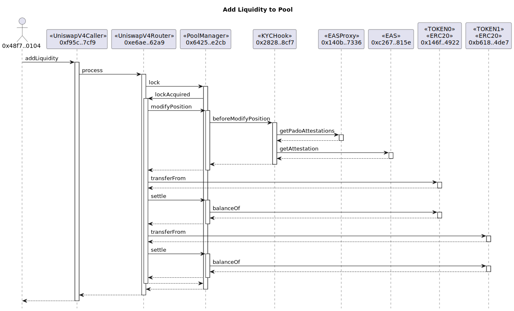
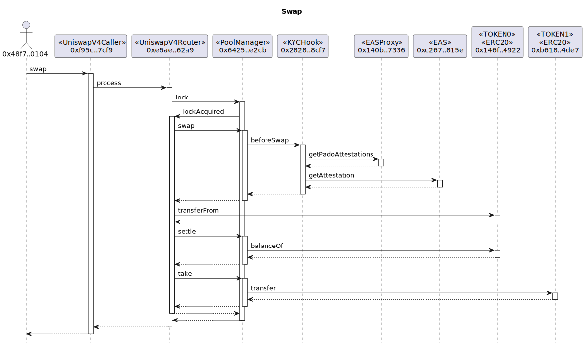
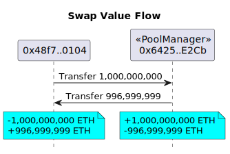

Under developing...


## Overview


## Install

Get the repo:

```sh
git clone --recursive https://github.com/pado-labs/pado-uniswap.git
```

### Hardhat

```sh
cd pado-uniswap
npm install
npm run compile
```


### Foundry

```sh
cd pado-uniswap
forge install
forge update v4-periphery
```


## Local


## KYC on Sepolia

Summary of the modify position calls (AddLiquidity):



Summary of the swap calls (Swap):



The swap value flows:



