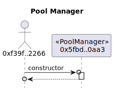
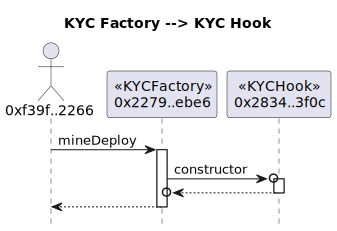
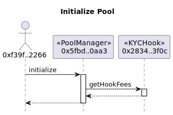
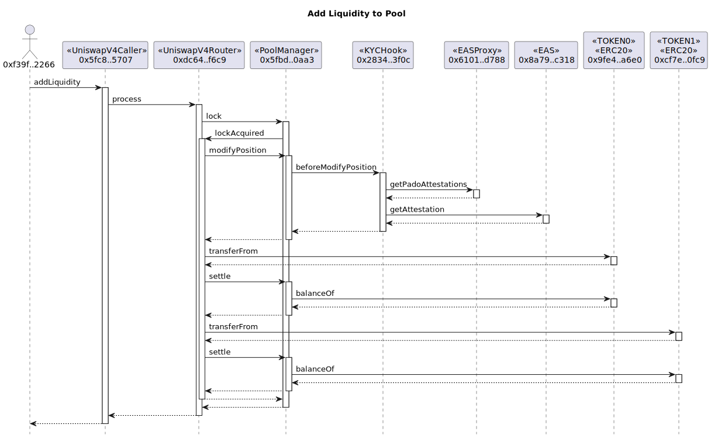
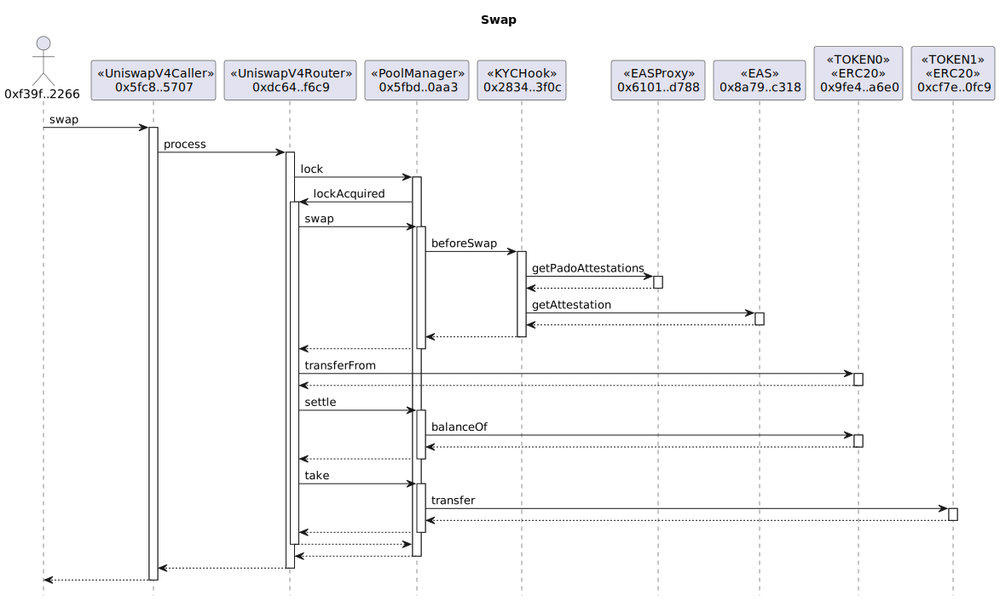
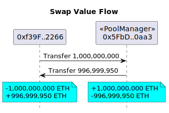

## Anvil (Foundry)

Currently, because v4 exceeds the bytecode limit of Ethereum(24576 bytes), we can only deploy the pool manager on a local node like [Anvil](https://book.getfoundry.sh/anvil/).


First of all, start a local node.

```sh
anvil --code-size-limit 30000
```


<br>

In the following steps, we use the default account:

```log
Account=0xf39Fd6e51aad88F6F4ce6aB8827279cffFb92266
PrivateKey=0xac0974bec39a17e36ba4a6b4d238ff944bacb478cbed5efcae784d7bf4f2ff80
```

### Steps

- Deploy the Uniswap v4 PoolManager by the [PoolManager](../script/PoolManagerScript.sol) script.

```sh
export RPC_URL=http://localhost:8545
export PRIVATE_KEY=0xac0974bec39a17e36ba4a6b4d238ff944bacb478cbed5efcae784d7bf4f2ff80

forge script script/PoolManagerScript.sol \
  --rpc-url $RPC_URL \
  --code-size-limit 30000 \
  --private-key $PRIVATE_KEY \
  --broadcast --optimize --optimizer-runs 1
```

output:

```
POOL_MANAGER=0x5FbDB2315678afecb367f032d93F642f64180aa3
```



<br/>

- Deploy the `Tokens`, `Router`, `Caller`, `KYCFactory` contracts, and make a token approving by the [KYCFirst](../script/KYCFirstScript.sol) script.

```sh
export POOL_MANAGER=0x5FbDB2315678afecb367f032d93F642f64180aa3

forge script script/KYCFirstScript.sol \
  --rpc-url $RPC_URL \
  --code-size-limit 30000 \
  --private-key $PRIVATE_KEY \
  --broadcast --optimize --optimizer-runs 1
```

output:

```log
TOKEN0=0x9fE46736679d2D9a65F0992F2272dE9f3c7fa6e0
TOKEN1=0xCf7Ed3AccA5a467e9e704C703E8D87F634fB0Fc9
ROUTER=0xDc64a140Aa3E981100a9becA4E685f962f0cF6C9
CALLER=0x5FC8d32690cc91D4c39d9d3abcBD16989F875707
KYC_FACTORY=0x2279B7A0a67DB372996a5FaB50D91eAA73d2eBe6
```

<br>


- Deploy the mock EAS and EASProxy by the [EAS](../script/EASScript.sol) script.


```sh
forge script script/EASScript.sol \
  --rpc-url $RPC_URL \
  --code-size-limit 30000 \
  --private-key $PRIVATE_KEY \
  --broadcast --optimize --optimizer-runs 1
```

output:

```log
EAS_ADDRESS=0x8A791620dd6260079BF849Dc5567aDC3F2FdC318
EASPROXY_ADDRESS=0x610178dA211FEF7D417bC0e6FeD39F05609AD788
```

<br>


- Deploy a `KYCHook` contract via the `KYCFactory` to generate the correct address prefix by the [KYCHook](../script/KYCHookScript.sol) script.

```sh
export SCHEMA_KYC_BYTES=0x5f868b117fd34565f3626396ba91ef0c9a607a0e406972655c5137c6d4291af9
export SCHEMA_COUNTRY_BYTES=0x5f868b117fd34565f3626396ba91ef0c9a607a0e406972655c5137c6d4291af9
export EAS_ADDRESS=0x8A791620dd6260079BF849Dc5567aDC3F2FdC318
export EASPROXY_ADDRESS=0x610178dA211FEF7D417bC0e6FeD39F05609AD788

export KYC_FACTORY=0x2279B7A0a67DB372996a5FaB50D91eAA73d2eBe6

forge script script/KYCHookScript.sol \
  --rpc-url $RPC_URL \
  --code-size-limit 30000 \
  --private-key $PRIVATE_KEY \
  --broadcast --optimize --optimizer-runs 1
```

output:

```log
KYC_HOOK=0x2834eD55aF8Fc06b060e864139565760b4853f0c
```





<br>

- Initialize a new `Uniswap v4 Pool` using the hook by the [InitializePool](../script/InitializePoolScript.sol) script.

```sh
export TOKEN0=0x9fE46736679d2D9a65F0992F2272dE9f3c7fa6e0
export TOKEN1=0xCf7Ed3AccA5a467e9e704C703E8D87F634fB0Fc9
export KYC_HOOK=0x2834eD55aF8Fc06b060e864139565760b4853f0c

forge script script/InitializePoolScript.sol \
  --rpc-url $RPC_URL \
  --code-size-limit 30000 \
  --private-key $PRIVATE_KEY \
  --broadcast --optimize --optimizer-runs 1

```



<br>

- Add token liquidity to the pool by the [AddLiquidity](../script/AddLiquidityScript.sol) script.

```sh
export CALLER=0x5FC8d32690cc91D4c39d9d3abcBD16989F875707

forge script script/AddLiquidityScript.sol \
  --rpc-url $RPC_URL \
  --code-size-limit 30000 \
  --private-key $PRIVATE_KEY \
  --broadcast --optimize --optimizer-runs 1
```



<br>


- Perform a token swap by the [Swap](../script/SwapScript.sol) script.

```sh
forge script script/SwapScript.sol \
  --rpc-url $RPC_URL \
  --code-size-limit 30000 \
  --private-key $PRIVATE_KEY \
  --broadcast --optimize --optimizer-runs 1
```




The swap value flows:




