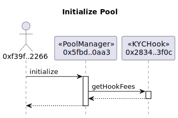

## Anvil (Hardhat)

Currently, because v4 exceeds the bytecode limit of Ethereum(24576 bytes), we can only deploy the pool manager on a local node like [Anvil](https://book.getfoundry.sh/anvil/).


First of all, start a local node.

```sh
anvil --code-size-limit 30000
```

> Q: Why not use `npx hardhat node` to start the local node?
> A: There is no place to set the node `code size limit` like anvil.


<br>

In the following steps, we use the default account:

```log
Account=0xf39Fd6e51aad88F6F4ce6aB8827279cffFb92266
PrivateKey=0xac0974bec39a17e36ba4a6b4d238ff944bacb478cbed5efcae784d7bf4f2ff80
```

### Steps

- Deploy the Uniswap v4 PoolManager by the [PoolManager](../scripts/testInitializePool.js) script.

```sh
npx hardhat run --network anvil scripts/deployPoolManager.js
```

output:

```
POOL_MANAGER=0x5FbDB2315678afecb367f032d93F642f64180aa3
```
append/replace the above address in [.address](../.address).


- Deploy the `Tokens`, `Router`, `Caller`, `KYCFactory` contracts, and make a token approving by the [KYCFirst](../scripts/deployKYCFirst.js) script.

```sh
npx hardhat run --network anvil scripts/deployKYCFirst.js
```

output:

```log
TOKEN0=0x9fE46736679d2D9a65F0992F2272dE9f3c7fa6e0
TOKEN1=0xe7f1725E7734CE288F8367e1Bb143E90bb3F0512
ROUTER=0xDc64a140Aa3E981100a9becA4E685f962f0cF6C9
CALLER=0x5FC8d32690cc91D4c39d9d3abcBD16989F875707
KYC_FACTORY=0x2279B7A0a67DB372996a5FaB50D91eAA73d2eBe6
```
append/replace the above addresses in `.address`.


<br>


- Deploy the mock EAS and EASProxy by the [EAS](../scripts/deployEAS.js) script.


```sh
npx hardhat run --network anvil scripts/deployEAS.js
```

output:

```log
EAS_ADDRESS=0x8A791620dd6260079BF849Dc5567aDC3F2FdC318
EASPROXY_ADDRESS=0x610178dA211FEF7D417bC0e6FeD39F05609AD788
```
append/replace the above addresses in `.address`.


<br>


- Deploy a `KYCHook` contract via the `KYCFactory` to generate the correct address prefix by the [KYCHook](../scripts/deployKYCHook.js) script. 

```sh
npx hardhat run --network anvil scripts/deployKYCHook.js
```

output: (Get this address by looking at the anvil output)

```log
KYC_HOOK=0x28b7c861FaF3CDb9b9c2Bce27fBA1A0E632c1C0b
```
append/replace the above address in `.address`.


<br>

- Initialize a new `Uniswap v4 Pool` using the hook by the [InitializePool](../scripts/testInitializePool.js) script.

```sh
npx hardhat run --network anvil scripts/testInitializePool.js
```




<br>


- Add token liquidity to the pool by the [AddLiquidity](../scripts/testAddLiquidity.js) script.

```sh
npx hardhat run --network anvil scripts/testAddLiquidity.js
```


<br>


- Perform a token swap by the [Swap](../scripts/testSwap.js) script.

```sh
npx hardhat run --network anvil scripts/testSwap.js
```


The swap value flows:


